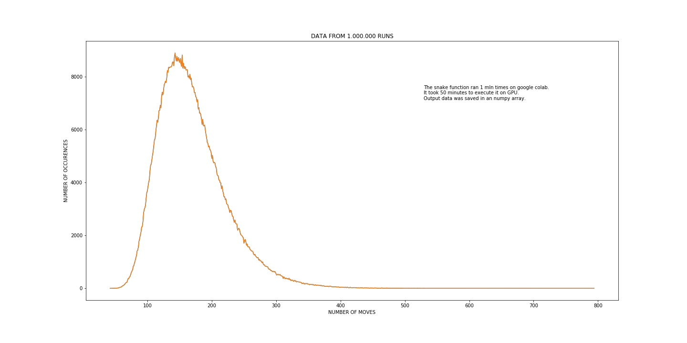

# numpy_snake

snake() is a function that uses **numpy** array to calculate possible moves on a grid box (numpy array).<br>
The rules are: 
- only forward moves are possible, backwards moves are vorbidden 
- it is allowed to take the same paths
- the aim is to visit every point (every coordinate) in the box. Coordinates are integer numbers.

The application calculates number of possible moves and steps and takes random choices - 
both the direction and the amount of steps are random.
The amount of steps during one move equals the snakes length and can only be taken between positions 
with integer coordinates (x, y).<br>
The result of calculation is returned and presented on a plot with **matplotlib** plot animation - _animate_snake.py_ <br>
Every run returns the total number of steps and moves.

##### Parameters: 

- rows, columns of the box - must be integers
- starting position: some box coordinates, e.g. (0, 1)

Example:
```
rows = 10
cols = 10
start_position = (1,4)
snake(rows, cols, position=start_position, verbose=True)
```
----
- snake.py - function module
- animate_snake.py - animation of all moves - _snake_red.mp4_ is an example of such animation
- snake_run.py - short application which collects data and plots graph from given runs of the snake function (like the graph at the end of the page)
- plot_1mln_runs.py - plotting results of 1 mln runs saved in a file (1mln_np_array_all.npy)
- 1mln_np_array_all.npy - array with saved results of 1 mln runs of snake(10, 10, (0,0))
----
After finishig the application I checked

**HOW MANY MOVES DOES THE APPLICATION NEED TO VISIT ALL THE BOX (ARRAY) POSITIONS.**

To find the answer I took the 10 x 10 dimention's array to collect data from 1 mln runs (_snake_run.py_).
To calculate all 1 mln moves I used Google Colab's GPU. It took 50 minutes to execute and collect data.<br>
The output array with all the results is saved in _1mln_np_array_all.npy_<br>
It seems, that the most frequent number of moves is around 150 - occured more than 8.000 times.<br>
6000 times the application needed between 110 and 200 moves.

The **minimum** number of moves to fill the box - **39**<br>
The **maximum** number of moves to cover the box - **686**<br>

- Mean:  169.58
- Median:  161
- Variance:  2812.4
- Standard deviation: 53.03


The graph below shows all 1 mln results:



