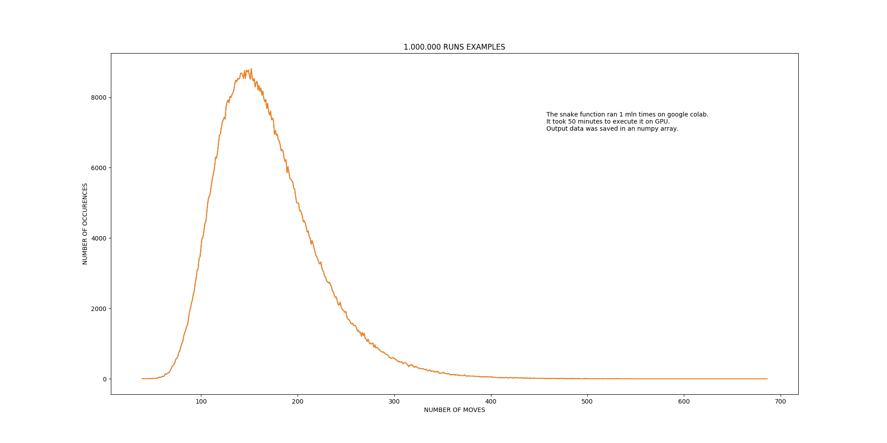

# numpy_snake

Snake is a function that uses **numpy** array to calculate possible moves on a grid box.

The rules are: 
- only forward moves are possible, backwards moves are vorbidden 
- it is allowed to take the same paths
- the aim is to visit every point (every coordinate) in the box. Coordinates are integer numbers.

The application calculates number of possible moves and steps and takes random choices - 
both the direction and the amount of steps are random.
The amount of steps during one move equals the snakes length and can only be taken between positions 
with integer coordinates (x, y).

The result of calculation is returned and presented on a plot with **matplotlib** plot animation.
Every run returns the total number of steps and moves.

###### Parameters: 

rows, columns of the box - must be integers

starting position: some box coordinates, e.g. (0, 0) - must be integers

Example:
```
rows = 10
cols = 10
start_position = (0,0)
snake(rows, cols, position=start_position, verbose=True)
```
----
- snake.py - function module
- animate_snake.py - animation of all moves - _snake_red.mp4_ is an example of such animation
- snake_run.py - short application which collects data from many runs of the snake function.
----
After finishig the application I wanted to check:

**HOW MANY MOVES DOES THE APPLICATION NEED TO VISIT ALL THE BOX (ARRAY) POSITIONS.**

I took the 10 x 10 dimention's array. To collect data from 1 mln runs I used Google Colab's GPU.
It took 50 minutes to execute and collect data. 
It seems, that the most frequent number of moves is around 150 - more than 8.000 times.
6000 times the application needed around 110 and 200 moves.

The **least** moves the program needed was **42.**

The **most** moves to cover the box were **794**



